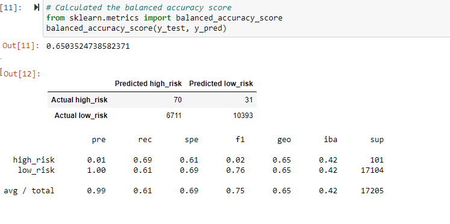
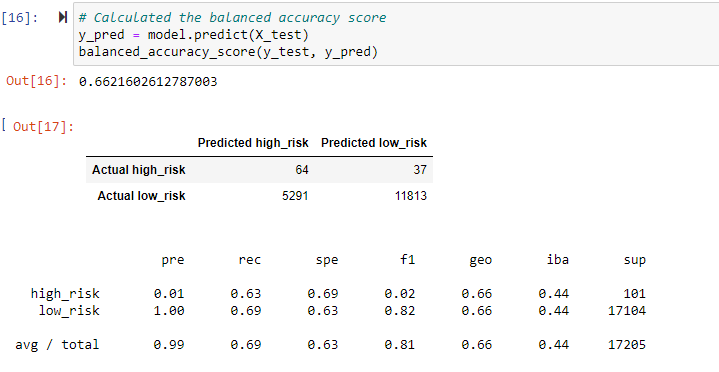
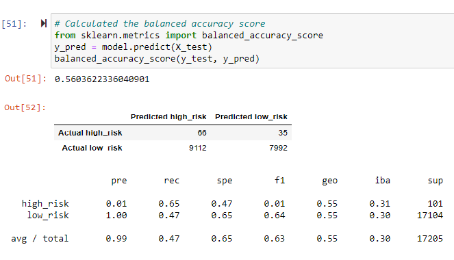
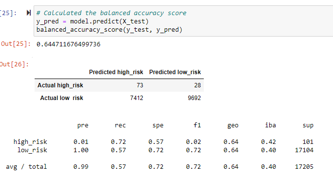
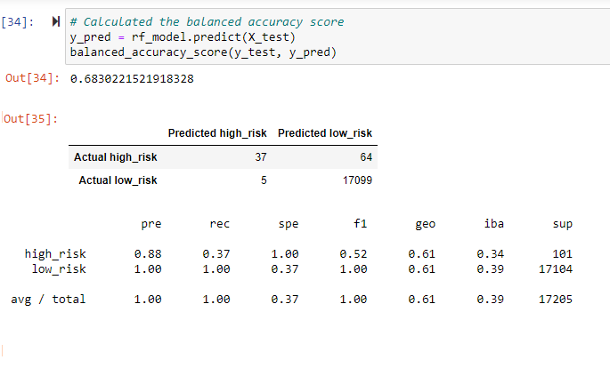
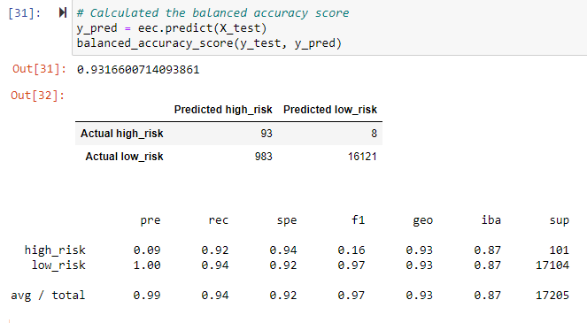

# Credit-Risk-Analysis

## Overview of the analysis 

Credit risk is an inherently unbalanced classification problem, as good loans easily outnumber risky loans.
Therefore, there is a need to employ different techniques to train and evaluate models with unbalanced classes.

## Purpose 

- To apply resampling models, SMOTEENN algorithm and Ensemble classifiers to predict credit risk. 

## Resources 

Dataset: LoanStat_2019Q1.csv,
Python 3.7.6 and Anaconda 2020.11 

## Results

#### Credit risk resampling Models

##### Oversampling 

The balanced accuracy score was 65% and the precision for the high risk had a very low positivity at 1% with a 
recall of 69% and the F1 was 2%. The higher number of populations for low risk resulted a 100% precision with a recall of 61%. 

##### SMOTE Oversampling 

Based on this model the balanced accuracy score was 66%, precision (1%), and F1 (2%) for high risk results were 
smilar to oversampling model. Due to the higher population for lowrisk, the precision for low risk was 100% with a recall of 69%. 

##### Undersampling 

The accuracy score for undersampling technique was 56%. The precision, recall and F1 for high risk were 1%, 65% and 1%, respectively. 
However, the precision and recall for low risk were 100% and 47%. 

##### Combination (Over and Under) Sampling

Based on this model the accuracy score was 64% and the high risk precision, recall and F1 were 1%, 72% and 2%, respectively. 
And the precision and recall for low risk were 100% and 57%. 

##### Balanced Random Forest Classifier

The Random Forest model shows the accuracy score of 68% and the precision, recall and F1 for high risk were 88%, 37% and 52%, respectively. 
The precision and recall for low risk were 100%. 

##### Easy Ensemble AdaBoost Classifier

The balanced accuracy score was 93% and the precision for high risk was 9% with 92% recall. 
The precision and recall for low risk were 100% and 94%, respectively. 

## Summary

Below is the summary of the top three models which scored the highest balanced accuracy scores:- 
- Easy Ensemble Classifier 93%.
- Random Forest 68%.
- SMOTE 66%.

Regarding Random Forest model, the precision and recall for low risk were 100%, however the accuracy score was 
lower than Ensemble Classifier. The Easy Ensemble model has predicted 93 observations as actual high risk (true positive) 
out of 101 observations (92%). Similarly, the actual low risk was predicted by 94% as true negative (16121 out of 17104).
Additionally, the accuracy score for Ensemble model was 93%. Therefore, I would recommend the Easy Ensemble Classifier
to use for prediction credit risk.  
